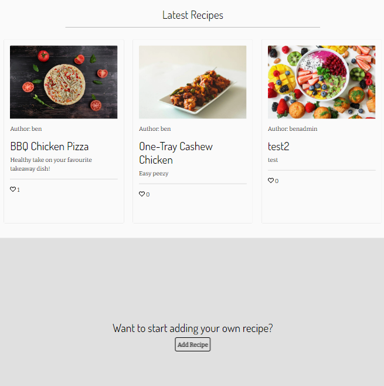

# Clean Eats Kitchen

Hello! This is my Fourth Project with the Code Institute and I have created a food recipe site called Clean Eats Kitchen. It has been built in Django using Python, JavaScript, CSS, and HTML, and enables users to create and share healthy recipes with other users around the world. It has been targeted toward people who want to eat healthy while allowing the meals to have a 'cheat' feel. Users are able to create their own accounts in order to share their own recipes. They can also comment and like recipes. 

This site has been centred around a centric database and allows full CRUD functionality. The site also ensures role-based permissions to separate user functionality and restrict certain content. 

---

live website link here

(Am I Responsive screenshots here)

## Table of Contents
* [User Experience Design (UX)](#UX)
    * [The Strategy Plane](#The-Strategy-Plane)
        * [Site Goals](#Site-Goals)
        * [User Stories](#User-Stories)
    * [The Scope Plane](#The-Scope-Plane)
    * [The Structure Plane](#The-Structure-Plane)
    * [The Skeleton Plane](#The-Skeleton-Plane)
        * [Wireframes](#Wireframe-mockups)
        * [Database Schema](#Database-Schema)
    * [The Surface Plane](#The-Surface-Plane)
* [Features](#features)
* [Future Enhancements](#future-enhancements)
* [Technologies Used](#technologies-used)
* [Testing](#testing)
* [Deployment](#deployment)
* [Credits](#credits)
---

## UX

### The Strategy Plane  

Clean eats kitchen is a friendly and social recipe sharing platform, which should help connect fellow foodies around the world. The elements and design of the website is to be attractive and enjoyable, whilst ensuring users can follow instructions in a clear and concise manner.  

#### Sites ideal user 
- Food lover looking to share their healthy recipes with others
- Food lover looking for recipe inspiration
- People with a healthy eating diet and lifestyle (e.g. Gym)
- Someone wishing to connect to foodies online
#### Site Goals
- To provide users with a website to find healthy recipes
- To provide users with a website to share their own recipes
- To provide users with a website to discover new recipes
- To provide users with a website where they can communicate with other users in a friendly environment

### Epics

1. Initial Django setup
2. User recipes
3. Recipe searching
4. Recipe viewing
5. User Profile
6. Recipe Create
7. Recipe Edit
8. Recipe Delete

Of the 8 User Epics I created 16 user stories to to develop these further and I categorised into 4 sections; Must have, Should have, Could have 
and won't have. From the 16 user stories 9 would be categorised as must have which equates to roughly 56% of this iteration. To manage this I have linked all user stories to my [kanban board](https://github.com/benlamb95/mp4-clean-eats-kitchen/projects/2). This has been my first time getting to grips with an agile working and planning the iterations by my self.

### User Stories

#### As a SuperUser:
- I can create, read, update and delete posts so that the website contains recipes relevant to the goals of its target audience
- I can approve users comments to ensure they are moderated for hate and distasteful comments

#### As a site User:
- I can view recipes clearly in a structured view with site pagination so that I can easily find the recipe I want
- I can view recipes clearly so that I can select one to follow
- I can clearly understand what the purpose of the site is for so that I can decide if I should stay on the website
- I can I can navigate easily around the site so that I am inquisitive and can find information I want
- I can create, update and delete my own profile so that I can log in to the site
- I can search for a recipe with keywords so that narrow my search for the recipe I am looking for
- I can search for other users profiles so that I can find out more about that user

#### As a registered User:
- I can save other peoples recipes so that they can be saved in my profile for ease of access in the future
- I can Like and unlike a recipe so that I can interact with other recipes
- I can leave comments on recipes so that I can ask questions and leave feedback for others
- I can Create, update and delete recipes so that I can share my own recipes with others
- I can sign in and out of my profile so that I can prevent other people accessing my account
- I can update my password so that I can ensure my account is safe
- I can update my profile with an image and some personal info so that I can customise my profile
---

## The Scope Plane

The features planned:
* Recipes- Create, Read, Update and Delete
* User Profile- User can register for a profile to create recipes and make comments on others aswell as like
* Users can log in and out of their profile to ensure no one else can use their profile
* Search functionality to allow users to find a recipe of their choice quickly and efficiently
* Commenting and liking of recipes
* Intuitive design
* Appealing Site

## The Structure Plane
I used a flowchart diagram to help visualise how I would want my site structure.  

  

As a site admin it is important that I have full control of what recipes are added to the website as I need to ensure that the recipes are healthy for its target audience, therefore I have made sure any recipes that a registered user trys to add has to be approved by the admin via the admin panel built by django. This is also the same for comments, as the comments that user make should support a welcoming environment and not have any negativety. 

## The Skeleton Plane
---
### Wireframes
To create my wireframes I used Balsamiq, which is a free-to-use wireframe software. I wanted to create my basic wireframes for the three main screen widths such as Desktop, Tablet, and Mobile. In order to help my design thinking process, I created the 4 main pages for my site so I can follow a similar style for my other smaller pages. Please follow the links below to view each wireframe individually.

#### Index page:

* [Index page desktop wireframe](/assets/wireframes/desktop-index.png)
* [Index page tablet wireframe](/assets/wireframes/tablet-index.png)
* [Index page mobile wireframe](/assets/wireframes/recipe-detail-mobile.png)

My index page aims to capture the users by being visually attractive and having a clear structure. My index page aims to be simple in layout with a clear indication of what the site’s aim is. 

#### Recipes Page:

* [Recipe page desktop wireframe](assets/wireframes/desktop-recipes-overview.png)
* [Recipe tablet desktop wireframe](assets/wireframes/tablet-recipes-overview.png)
* [Recipe mobile desktop wireframe](assets/wireframes/mobile-recipe-overview.png)

My recipes page section should be clearly structured in meal time order (Breakfast, dinner, tea, treats). This should allow ease of navigation and should help users narrow their search field without needing the known the exact recipe they are after. This page should be again visually beautiful through colours and animations. 

#### Recipe instructions:

* [Individual recipe instructions page desktop wireframe](assets/wireframes/desktop-recipes-steps.png)
* [Individual recipe instructions page tablet wireframe](assets/wireframes/tablet-recipe-steps.png)
* [Individual recipe instructions page mobile wireframe](assets/wireframes/mobile-recipe-steps.png)

The recipe instructions should be again simple in design and well structured. This should include unordered bullet points for the ingredients and numbered bullet points for the instructions so user can clearly distinguish each section. Information on this page needs to be clear and concise for readability. 
#### Profile Page:

* [Profile page desktop wireframe](assets/wireframes/desktop-profilepage.png)
* [Profile page tablet wireframe](assets/wireframes/tablet-profilepage.png)
* [Profile page mobile wireframe](assets/wireframes/mobile-profilepage.png)

The profile page aims to be a hub where users can edit and delete their own profiles. This should act as a page where they can easily navigate to previous recipes they have liked and their own recipes they have added to the website. 

---

### Database Schema

To create my back end database I have used the built-in PostgreSQL from Heroku. I have designed my database using [drawSQL](https://drawsql.app/), this is a free-to-use software however quite limited, as some fields didn’t allow me to overwrite them, such as Image fields. To help with the authentication Django has a built-in user Model Allauth which helps save time creating my own Model.  

I have created my own user profile model, as this will be needed to allow users to create their own recipes. I have then split the recipe for Ingredients and Steps because a recipe could have many different steps and ingredients. To help with this logic I used [sqlservercentral](https://www.sqlservercentral.com/forums/topic/database-design-for-storing-recipes) & [dev.to](https://dev.to/amckean12/designing-a-relational-database-for-a-cookbook-4nj6).  

## The Surface Plane

### Design and Colours 

Once I set out my structure of my site I began thinking about colours of my site. I wanted to keep my website colour scheme to be limited in the amoutn of colours I selected yet still ensure the website looks attractive. I decided to use white and black throughout my site as this has the best contrast to ensure poeple can easily view the content. However i decided to use a sage green (#878e76) to add a dash of colour and make the site more attractive. I did make a last minute design change after looking at a lighthouse report of my site which advised the colours of my sage green and white would be too difficult to see for users, therefore I decided to use black text thorughout my site.  
  

#### Typography
I used Google fonts to find a suitable font style for my recipe site. I decided to select two font styles one for my headings and the other for my main body. I used Dosis for my headers which is a Sans-Serif font family and Bitter for the body which is a slab serif typeface. I felt they worked really well together and both allowed a comfortable reading display on any computer or device.   

#### Images
I used Pexels which is a free image sharing website once you have set up an account. I felt the images Pexels provide are clean, simple and crisp so they help elevate a websites appearance. I used a background image for the index page to capture the users attention while fitting in with the theme of it being a kitchen worktop. The placeholder image I used was a fruit bowl. I thought this should be used as for one it is an image of healthy food which is one of the main site goals for the site and it is also bright and eye catching. 

## Features
---

### Navigation Bar

The navigation bar which sits at the top of the site is key across all devices and is role based so depending on whether or not you are signed in, it will appear slighlty different. 
  

The above Nav bar is what users will see if they are on larger screen devices. It has 4 easy to read and understandable links that direct the user in the direction they wish to go. When a user hovers over the links, an underline effect appears under each link to help signify the link they are about to select. On the far right there is a search section which has placeholder text explaining how that search bar can be used.  

  
The above Nav Bar is for when a user is a registered user and has signed up to the site. It wouldn't make sense for the Nav bar to still display login/Sign up there it changes to logout but also includes a profiles section and create a recipe section.  

  

Having a site that is resposive is vital for it to be a success therefore I used bootstraps nav bar to implement a smaller nav bar that puts all the links within a burger Icon. Once a user clicks this icon the below screenshot will show how the links appear.  

  

### Footer 
  
Like the navigation bar, my footer is present within all of my site. It is very basic in design as it only contains links to socials but ensures these links are open in a seperate tab to ensure the user can find their way back to the site easily.  

### Index page 
  

I wanted the index to be eye capturing and draw a user in whilst also explaining the purpose of the site clearly. To do this I have used an attractive hero image with the title of the site centered with a glass effect to stand out. I have then broken up the site by using a sage green background with white text to make this section stand out with it being the sites purpose.  

  

The user is then presented with the three most recent recipes created by existing users. This is to entice the user into seeing recipes that have already been made and make them want to look for more within the site. This is then followed up with a rhetorical question which should again try to attract the user to sign up for the site to share their own recipes.  

### All recipes  
  
This is the view for when a user wishes to view all current recipes and is presented the same when a user searches for the recipe. Recipes for larger screens are stacked next to each other in a row of three but as the device screen gets smaller it then stacks 1 item per row. I have seperated the recipe cards enough with a column gap and a feint border.  

  
The actual card itself is very basic in design. The image of the recipe is the most eye catching as this aims to draw in the user to view the recipe. When a user is hovering over a card the image scales in size. The card also contains the necessary info including the recipe creator, the name of the recipe, a brief description and the number of likes it has. 

#### Technologies Used

* HTML
    * HTML was used as the base language for the templates created for the site. 

* CSS
    * Custom CSS style was used to create my own look and presentation of the site to avoid the site looking too much like a bootstrap site.

* Bootstrap 5.13
    * Bootstrap was used for general layout and ease of creating elements within the site with its predefined templates.

* Jinja/Django Templating
    * Jinja/Django templating language was utilised to create HTML, XML or other markup formats that are returned to the user via an HTTP response

* JavaScript
    * To create custom functionality and create responsive elements and interfaces for the user

* Python
    
* Django
    * Python Framework
    * Django AllAuth 

* Heroku
    * Was used as the cloud based platform to deploy the site.

* Heroku PostgreSQL
    * Heroku PostgreSQL was used as the database for this project during development and in production.

## Credits

* A lot of my inspiration was taken from the Code Institute Django walk through project.
* [CodingEntrepeneurs](https://www.youtube.com/playlist?list=PLEsfXFp6DpzRMby_cSoWTFw8zaMdTEXgL) YouTube walkthrough.
* [Codemy](https://www.youtube.com/playlist?list=PLCC34OHNcOtr025c1kHSPrnP18YPB-NFi) YouTube walkthrough.
* All other credits used are referenced where appropriate in the given file.
* Code Institue Tutor support for their advice and patience when things wasn't going so well for me

### Resources

* W3C Schools
* Google Developer Tools
* Stack Overflow
* Pexels
* Font Awesome
* Google Fonts
* Cloudinary- For image storage