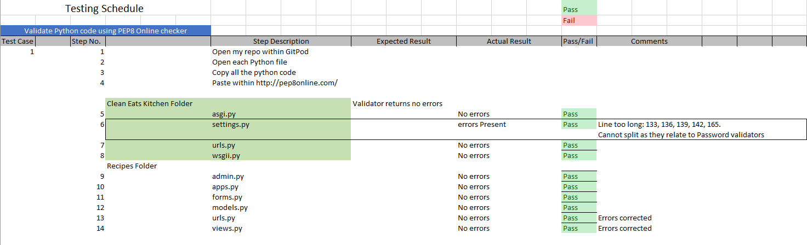
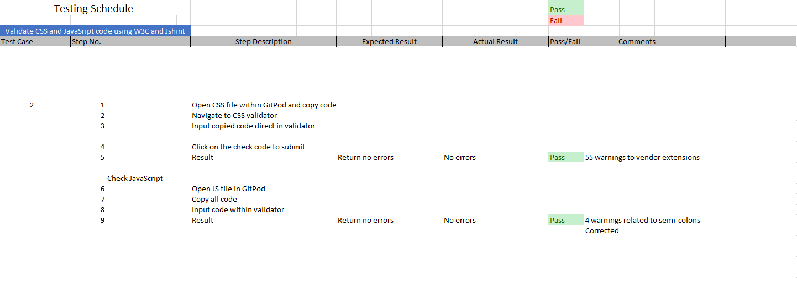
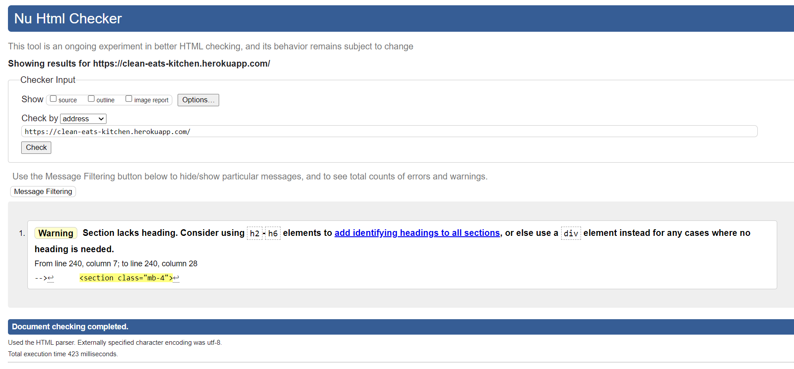
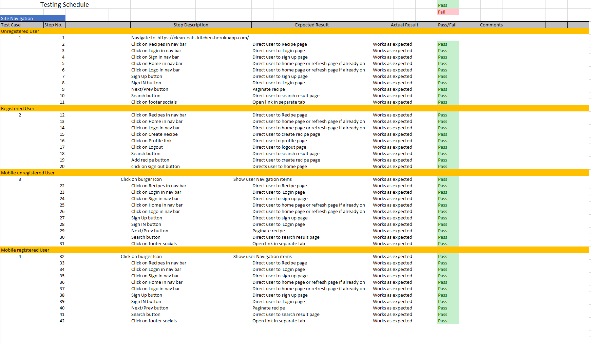
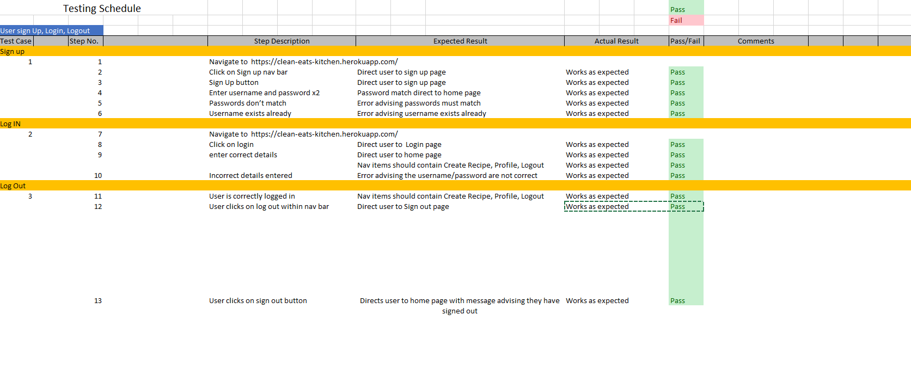
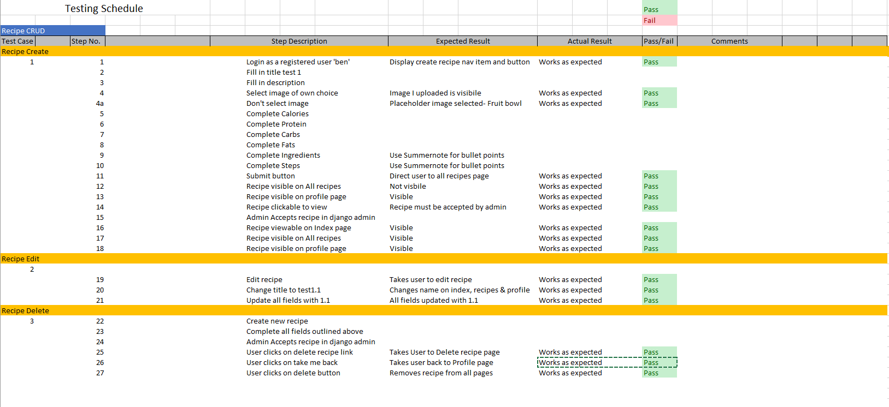
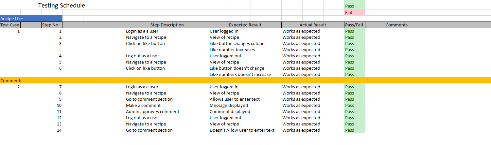
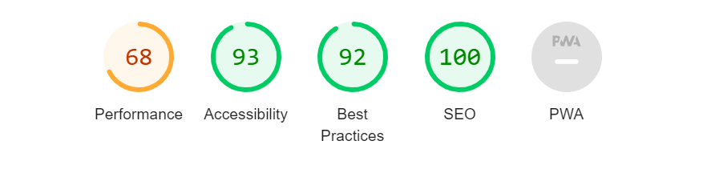

# Testing Schedule 

## Python file checker with PEP8

  

All Python files were entered into the PEP8 online checker to find if they contained any errors. In some cases, there were errors notified which were duly corrected.  A few errors were raised in the settings file, however, these were default Django authorisation code and could not be changed to remove the errors.

Individual screenshots for the PEP8 Validators can be found below:

#### Clean Eats Kitchen Folder
* [asgii.py](static/images/testing/asgi-pep8.png)
* [settings.py](static/images/testing/settings1-pep8.png)
* [urls.py](static/images/testing/urls1-pep8.png)
* [wsgii.py](static/images/testing/wsgii-pep8.png)

#### Recipes Folder
* [admin.py](static/images/testing/admin-pep8.png)
* [apps.py](static/images/testing/apps-pep8.png)
* [forms.py](static/images/testing/forms-pep8.png)
* [urls.py](static/images/testing/urls2-pep8.png)
* [views.py](static/images/testing/views-pep8.png)

## CSS and JavaScript Checker with W3C Online

  

Individual screenshots for the Validators can be found below:
* [CSS](static/images/testing/css-validator.png)

* [JS](static/images/testing/javascript-validator.png)

## HTML Checker with W3C Online

For my HTML validator I initially ran into some issues as I tried to input the text direct and the validator wouldn't recognise Jinja templating. Therefore I checked via the URI. This is the result:

  
The warning related to a section within my footer, however, this had come from bootstraps footer template, therefore I have not touched this code.

## Site Navigation testing  
  

To test mobile device functionality for the navigation I used an iPhone XS.

## User Sign In, Sign Out and Sign Up functionality
  

## Recipe CRUD (Create, read, update and delete)
  
The recipe CRUD functionality was tested extensively as this is the main focus of my site. I have ensured that a user can only have a recipe added to the site once the admin has accepted it within the Django admin panel. Moving forward and within my next iteration, I would like to add the functionality of the admin being able to moderate the recipes within the site rather than having to go to the Django admin. 

## Like and commenting on a recipe
  

## Light house scores
  
The lighthouse report did suggest a poor performance but after looking at the reasons it suggested delivering JS/ CSS inline. This is currently out of my learning scope and something which I’m currently not aware of how to improve.  This is also the same for cache policy but again this is something I’m sure in the future will be something I look at.  

Back to [README.md](README.md) file.
